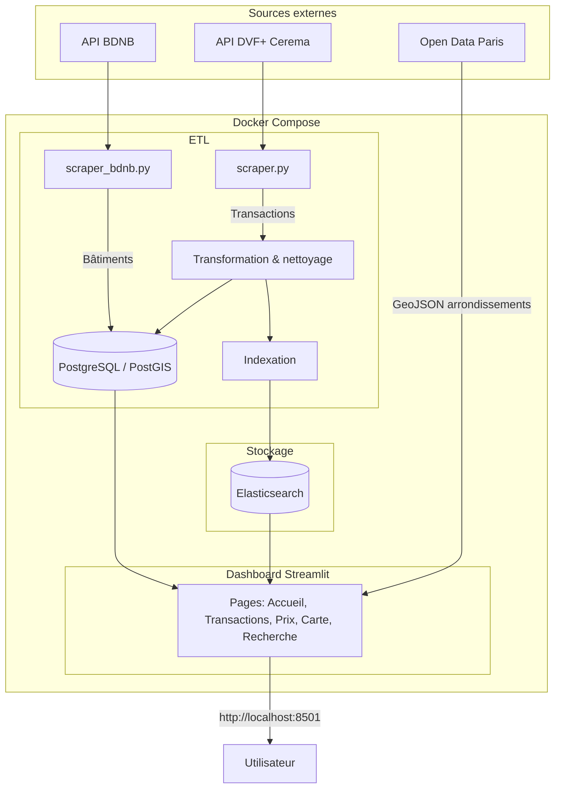

# DVF Paris : Analyse des Transactions Immobilières

Projet réalisé par **Iris Carron** et **Cléo Detrez**, étudiantes en école d'ingénieurs, dans le cadre de l'unité Data Engineering (2025/2026).

Application web qui scrape automatiquement les transactions immobilières parisiennes et les bâtiments, les stocke en base de données, et les restitue sous forme de visualisations interactives : graphiques, cartes choroplèthes, indicateurs de synthèse et moteur de recherche Elasticsearch.

---

# Guide utilisateur

## Prérequis

Docker et Docker Compose installés sur la machine. Un minimum de 4 Go de RAM est recommandé (Elasticsearch est gourmand en mémoire). Une connexion internet est requise pour le scraping des données.

## Installation et lancement

```bash
git clone <url-du-repo>
cd Projet_data_engineering
docker-compose up --build
```

L'application est ensuite accessible à l'adresse **http://localhost:8501**.

Au premier lancement, le scraping se lance automatiquement en deux phases. D'abord, les transactions immobilières sont scrapées depuis l'API DVF+ du Cerema pour les 20 arrondissements (**5 à 15 minutes**). Ensuite, les bâtiments sont scrapés depuis l'API BDNB (**5 à 30 minutes** selon la limite configurée). Une fois le scraping terminé, le dashboard Streamlit se lance.

### Réinitialiser et relancer

Pour repartir de zéro (vider la base et relancer le scraping complet) :

```bash
docker-compose down -v
docker-compose up --build
```

La commande `down -v` supprime les containers et les volumes (base de données, index Elasticsearch). La commande `up --build` reconstruit l'image et relance l'ensemble du pipeline.

### Alternative : charger les bâtiments depuis le cadastre local

Il est possible de charger les bâtiments depuis le fichier cadastral inclus dans le projet (`data/cadastre/cadastre-75-batiments.json`) au lieu de scraper l'API BDNB. Cela permet d'obtenir la couverture complète de Paris (110 000+ bâtiments) sans dépendre de l'API. Cette commande ne concerne que les bâtiments pour la carte ; les transactions doivent toujours être scrapées via le pipeline standard.

```bash
docker-compose exec app python etl/load_cadastre.py
```

Nous ne conseillons pas cette approche car le chargement de 110 000 bâtiments rend l'affichage de la carte tres long. Le scraping via l'API BDNB est limité à 3 000 bâtiments par défaut mais cette valeur peut être augmentée dans `etl/scraper_bdnb.py`.

## Commandes utiles

Relancer le scraping des transactions :

```bash
docker-compose exec app python etl/scraper.py
```

Relancer le scraping des bâtiments :

```bash
docker-compose exec app python etl/scraper_bdnb.py
```

Accéder directement à la base PostgreSQL :

```bash
docker-compose exec db psql -U dvf -d dvf
```

---

# Guide développeur

## Structure du projet

```
Projet_data_engineering/
│
├── main.py                     Point d'entrée
├── docker-compose.yml          Orchestration des 3 services
├── requirements.txt            Dépendances Python
│
├── dash/                       Interface Streamlit
│   ├── router.py               Routage des pages
│   ├── layout.py               Filtres, chargement des données, utilitaires
│   ├── navbar.py               Barre de navigation
│   ├── splash.py               Page d'accueil
│   ├── home.py                 Pages Transactions et Prix
│   ├── recherche.py            Recherche Elasticsearch
│   ├── carte.py                Cartes choroplèthes
│   └── setup.py                Configuration Streamlit
│
├── etl/                        Pipeline ETL
│   ├── scraper.py              Scraping API DVF+ (transactions)
│   ├── scraper_bdnb.py         Scraping API BDNB (bâtiments)
│   ├── load_cadastre.py        Chargement cadastre local
│   ├── elasticsearch_utils.py  Indexation Elasticsearch
│   └── clean_load.py           Nettoyage des données
│
├── docker/
│   ├── Dockerfile              Image Python 3.11
│   ├── entrypoint.sh           Scraping auto puis lancement Streamlit
│   └── init-db.sql             Création de la table transactions
│
└── data/                       GeoJSON et cadastre
```

## Architecture



## Fonctionnalités et interactions

- **Scraping automatique** : `entrypoint.sh` vérifie si la base est vide au démarrage. Si oui, il lance `scraper.py` (transactions DVF) puis `scraper_bdnb.py` (bâtiments BDNB) avant de démarrer Streamlit.
- **Jointure spatiale** : les bâtiments sont liés aux transactions par proximité géographique (rayon de 200m) via PostGIS (`ST_DWithin`). Le prix au m² de chaque bâtiment est la moyenne des transactions proches.
- **Recherche Elasticsearch** : les transactions sont indexées avec un mapping français et un champ composite pour la recherche floue. La détection d'arrondissement dans la requête est automatique.
- **Filtres partagés** : les pages Transactions, Prix et Carte partagent les mêmes filtres (années, arrondissements, type de bien, prix) via `layout.render_filters_sidebar()`.

## Schéma de la base de données

Table `transactions` :

| Colonne | Type | Description |
|---|---|---|
| id | SERIAL | Identifiant unique |
| id_mutation | VARCHAR | Identifiant de la mutation DVF |
| date_mutation | DATE | Date de la transaction |
| valeur_fonciere | NUMERIC | Prix de vente en euros |
| surface_reelle_bati | NUMERIC | Surface en m² |
| prix_m2 | NUMERIC | Prix au m² calculé |
| nb_pieces | INTEGER | Nombre de pièces |
| type_local | VARCHAR | Type de bien (appartement, maison, etc.) |
| nature_mutation | VARCHAR | Nature de la vente |
| code_postal | VARCHAR | Code postal |
| arrondissement | VARCHAR | Numéro d'arrondissement |
| latitude | NUMERIC | Coordonnée GPS |
| longitude | NUMERIC | Coordonnée GPS |
| scraped_at | TIMESTAMP | Date de collecte |

Table `batiments` :

| Colonne | Type | Description |
|---|---|---|
| id | SERIAL | Identifiant unique |
| batiment_groupe_id | TEXT | Identifiant BDNB du bâtiment |
| id_parcelle | TEXT | Identifiant de la parcelle cadastrale |
| annee_construction | INTEGER | Année de construction |
| classe_dpe | TEXT | Classe énergétique (A à G) |
| nb_logements | INTEGER | Nombre de logements |
| commune | TEXT | Commune INSEE |
| geom | GEOMETRY | Géométrie PostGIS du bâtiment |
| scraped_at | TIMESTAMP | Date de collecte |

## Variables d'environnement

| Variable | Description | Valeur par défaut |
|---|---|---|
| DATABASE_URL | Chaîne de connexion PostgreSQL | postgresql://dvf:dvf@db:5432/dvf |
| ELASTICSEARCH_URL | URL du service Elasticsearch | http://elasticsearch:9200 |

En exécution locale (hors Docker), remplacer les noms de services par `localhost`.

---

# Rapport d'analyse

Détail des pages du dashboard et des visualisations proposées.

## Page d'accueil

C'est la première page affichée à l'ouverture de l'application. Elle présente brièvement le projet et propose six cartes de navigation qui mènent directement aux différentes sections du dashboard. Son rôle est d'orienter l'utilisateur et de lui donner une vue d'ensemble des fonctionnalités disponibles.


## Accueil

Cette page fait office de guide pour l'utilisateur. Elle explique les termes utilisés dans le dashboard sous forme de quatre cartes thématiques : les types d'habitation (appartement, maison, dépendance, local industriel), les types de vente (vente classique, VEFA, adjudication, expropriation), les indicateurs clés (valeur foncière, prix au m², surface, nombre de pièces) et les sources de données. Elle permet à un utilisateur non spécialiste de l'immobilier de comprendre les données présentées dans les autres pages.


## Transactions

Cette page sert à analyser le volume et la nature des transactions immobilières. Elle affiche cinq indicateurs de synthèse en haut de page : nombre total de transactions, prix moyen, prix médian au m², surface moyenne, et nombre de grosses ventes dans le top 5%. En dessous, trois graphiques complètent l'analyse : un histogramme de l'évolution mensuelle du volume de transactions (pour repérer les périodes d'activité), un diagramme circulaire de la répartition par type de mutation (vente classique, VEFA, adjudication, etc.), et un nuage de points des transactions les plus importantes colorées par arrondissement (pour identifier les ventes exceptionnelles). Des filtres dans la colonne de gauche permettent de restreindre la période, les arrondissements, les types de bien et la tranche de prix.


## Prix

Cette page est dédiée à l'analyse comparative des prix. Elle présente quatre indicateurs statistiques (prix minimum, premier quartile, troisième quartile, prix maximum) puis quatre graphiques : le prix médian de vente par arrondissement (pour comparer les arrondissements entre eux), l'évolution mensuelle du prix médian au m² (pour observer la tendance du marché), la distribution statistique du prix au m² par arrondissement sous forme de boîtes à moustaches (pour visualiser la dispersion et les valeurs atypiques), et le prix médian selon le type de bien (pour comparer appartements, maisons, locaux commerciaux, etc.). Les mêmes filtres que la page Transactions sont disponibles.


## Carte

Cette page offre deux modes de visualisation géographique, sélectionnables via un menu déroulant. Le mode "Arrondissements" affiche une carte choroplèthe de Paris colorée selon le prix moyen au m² dans chaque arrondissement ; le survol de chaque zone indique le nombre de transactions, le prix au m² et le prix moyen. Le mode "Bâtiments" affiche les polygones individuels des immeubles ayant fait l'objet d'une transaction, colorés selon leur prix moyen au m². Pour chaque bâtiment, le prix au m² est calculé en faisant la moyenne de toutes les transactions situées à proximité. Les mêmes filtres (années, arrondissements, type de bien, prix) s'appliquent aux deux modes.


La capture ci-dessus montre le rendu de la vue "Bâtiments" avec une limite de 3 000 bâtiments scrapés depuis l'API BDNB (valeur par défaut). Cette limite est configurable dans le fichier `etl/scraper_bdnb.py` (variable `limit_total`). Il est possible de l'augmenter jusqu'à 50 000 pour couvrir davantage de bâtiments parisiens, au prix d'un temps de scraping plus long (l'API BDNB renvoie 10 résultats par requête).

## Recherche

Cette page exploite le moteur de recherche Elasticsearch pour permettre une recherche en texte libre parmi les transactions. L'utilisateur saisit une requête en langage naturel, par exemple "appartement 16ème" ou "maison 5 pièces". Le système détecte automatiquement le numéro d'arrondissement dans la requête et l'applique comme filtre. Un champ budget maximum permet de borner les résultats par prix. Les résultats sont présentés sous trois onglets : une liste détaillée des 20 premières transactions avec prix et caractéristiques, des graphiques analytiques (répartition par arrondissement, distribution des prix, prix par type de bien), et une carte de localisation des résultats. Quatre indicateurs (nombre de résultats, prix moyen, prix médian au m², surface moyenne) synthétisent les résultats en haut de page.


---

## Sources des données

| Ressource | Lien |
|---|---|
| API DVF+ Cerema - mutations (source scrapée) | https://apidf-preprod.cerema.fr/dvf_opendata/mutations/ |
| API DVF+ Cerema - géomutations (source scrapée) | https://apidf-preprod.cerema.fr/dvf_opendata/geomutations/ |
| API BDNB - bâtiments (source scrapée) | https://api.bdnb.io/v1/bdnb/donnees/batiment_groupe_complet |
| Open Data Paris - contours des arrondissements (téléchargé) | https://opendata.paris.fr/explore/dataset/arrondissements/export/ |
| Documentation DVF Cerema | https://datafoncier.cerema.fr |
| Documentation BDNB | https://bdnb.io |

## Auteures

**Iris Carron** et **Cléo Detrez**

Projet réalisé dans le cadre de l'unité Data Engineering, année universitaire 2025/2026.
