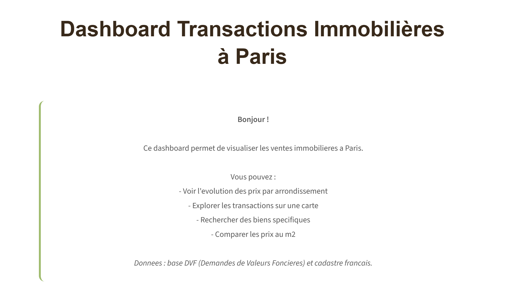
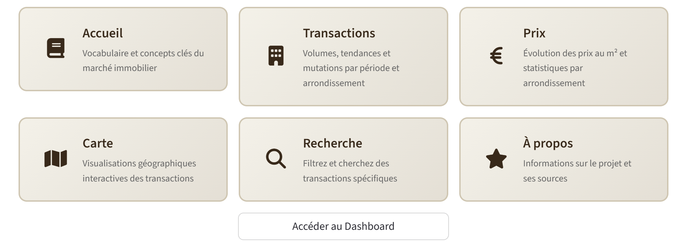
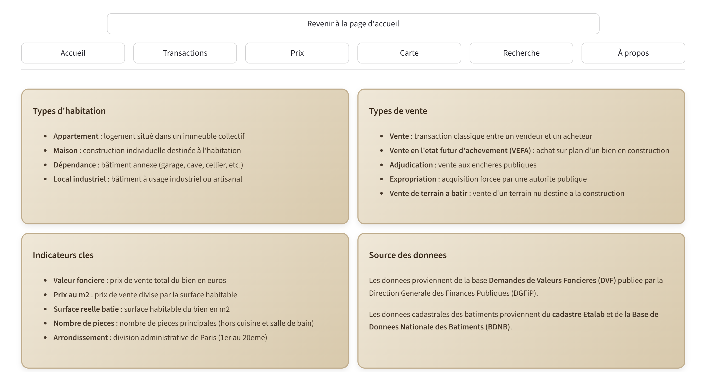
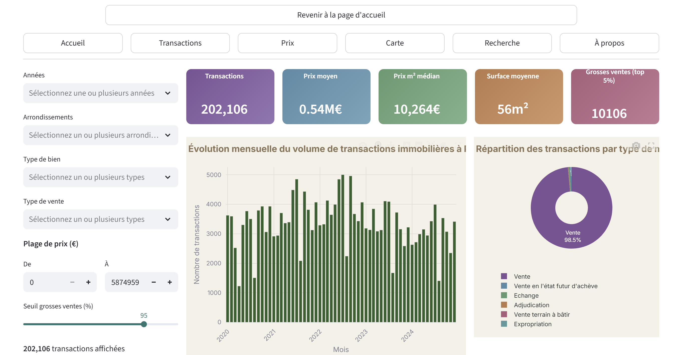
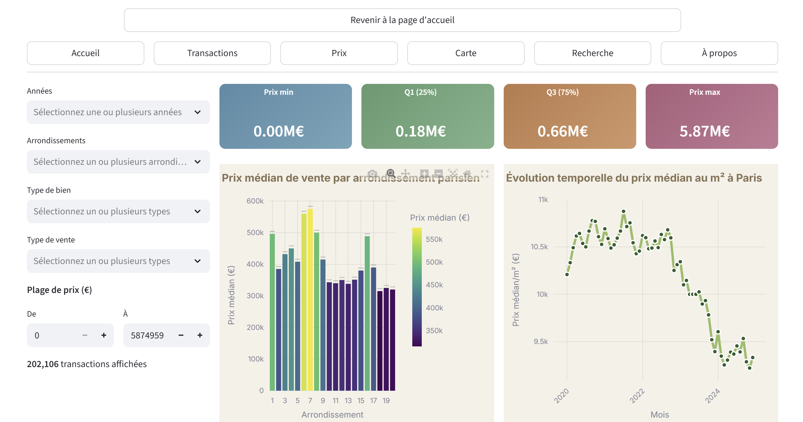
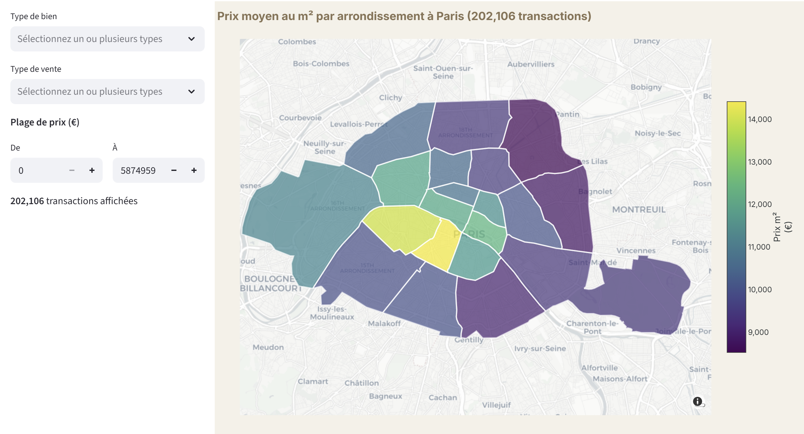
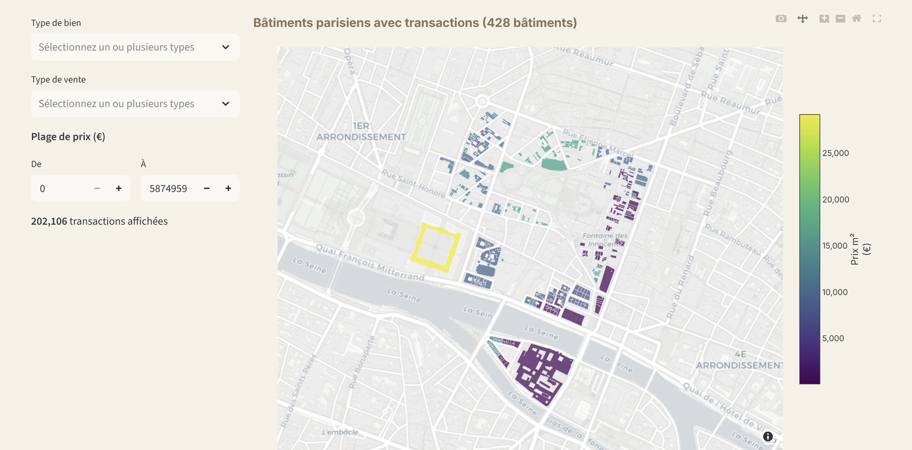
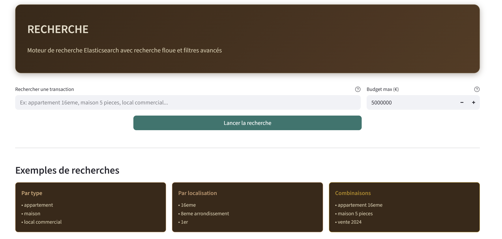

# DVF Paris : Analyse des Transactions Immobilières

Projet réalisé par **Iris Carron** et **Cléo Detrez**, étudiantes en école d'ingénieurs, dans le cadre de l'unité Data Engineering (2025/2026).

## Pourquoi ce projet

Le marché immobilier parisien est l'un des plus dynamiques et complexes de France. Les prix varient fortement d'un arrondissement à l'autre, d'un type de bien à l'autre, et évoluent au fil du temps. Pourtant, ces données restent difficilement exploitables en l'état : elles sont dispersées sur des plateformes institutionnelles, volumineuses, et peu lisibles pour un utilisateur non technique.

Nous avons choisi de scraper les données de l'API DVF+ du Cerema, qui expose les Demandes de Valeurs Foncières (transactions immobilières enregistrées par l'administration fiscale) pour l'ensemble du territoire français. Notre périmètre se concentre sur les 20 arrondissements de Paris.

L'objectif est de proposer une application web complète qui collecte ces données automatiquement, les stocke dans une base de données, et les restitue sous forme de visualisations interactives : graphiques, cartes, indicateurs de synthèse et moteur de recherche. L'utilisateur peut ainsi explorer le marché parisien, comparer les prix entre arrondissements, observer les tendances, et rechercher des transactions spécifiques sans manipuler de données brutes.

Le projet met en pratique l'ensemble des concepts abordés pendant l'unité : scraping de données depuis une source web, stockage en base de données relationnelle, création d'une application web en Python, affichage optimisé des données, conteneurisation des services avec Docker. Le scraping s'effectue en temps réel au lancement du projet, l'orchestration des services repose sur Docker Compose, et un moteur de recherche Elasticsearch est intégré pour la recherche avancée.

## Origine des données

Les données scrapées proviennent de l'API DVF+ du Cerema. Le Cerema (Centre d'études et d'expertise sur les risques, l'environnement, la mobilité et l'aménagement) met à disposition cette API au dessus de la base DVF publiée par la Direction Générale des Finances Publiques (DGFiP). La base DVF recense l'ensemble des transactions immobilières réalisées en France : prix de vente, date, type de bien, surface, nombre de pièces et localisation. Elle est mise à jour deux fois par an (avril et octobre) et disponible en open data sous licence ouverte Etalab.

L'API expose deux points d'accès que notre scraper utilise.

**Le point d'accès "mutations"** renvoie les données tabulaires de chaque transaction : prix, date, surface, type de bien, arrondissement, etc. C'est le point d'accès utilisé par défaut au lancement de l'application.

**Le point d'accès "géomutations"** renvoie les mêmes informations enrichies des géométries cadastrales des parcelles concernées (polygones GeoJSON). Ces géométries permettent de calculer les coordonnées GPS précises de chaque transaction et d'afficher les contours réels des bâtiments sur la carte. Ce point d'accès est plus lent à interroger car les réponses sont beaucoup plus volumineuses.

En complément, les contours géographiques des 20 arrondissements de Paris sont téléchargés depuis la plateforme Open Data de la Ville de Paris (opendata.paris.fr) sous forme de GeoJSON, et servent à l'affichage de la carte choroplèthe.

## Scraping et temps de collecte

Le scraping s'effectue automatiquement au lancement de l'application si la base de données est vide. Le scraper interroge l'API DVF+ pour chacun des 20 arrondissements de Paris (codes INSEE 75101 à 75120), en paginant automatiquement les résultats par lots de 500. Un mécanisme de retry avec backoff exponentiel gère les erreurs réseau.

Il existe deux modes de scraping.

**Mode standard (par défaut).** Le scraper interroge le point d'accès "mutations". Les coordonnées GPS de chaque transaction sont approximées à partir du centre géographique de l'arrondissement correspondant. Ce mode prend environ **5 à 15 minutes** selon la période couverte et la qualité de la connexion internet.

**Mode avec géométries (option --geo).** Le scraper interroge le point d'accès "géomutations". Les coordonnées GPS sont calculées précisément à partir du centroïde du polygone cadastral de chaque parcelle, et les géométries sont stockées en base pour être affichées sur la carte. Ce mode est **beaucoup plus long** : il faut compter **30 minutes à plus d'une heure** pour une collecte complète, car les réponses contenant les géométries sont significativement plus volumineuses. En revanche, il est indispensable pour exploiter la vue "Bâtiments" de la page Carte, qui affiche les polygones réels des immeubles.

Dans les deux cas, la collecte est suivie d'une phase de transformation (calcul du prix au m², nettoyage des valeurs aberrantes, normalisation des champs), puis du chargement en base PostgreSQL et de l'indexation dans Elasticsearch.

## Architecture du projet

```
Projet_data_engineering/
│
├── main.py                     Point d'entrée de l'application
├── docker-compose.yml          Orchestration des services
├── requirements.txt            Dépendances Python
│
├── dash/                       Interface Streamlit multi-pages
│   ├── router.py               Routeur principal et navigation
│   ├── layout.py               Thème, utilitaires et chargement des données
│   ├── navbar.py               Barre de navigation
│   ├── splash.py               Page d'accueil
│   ├── home.py                 Pages Accueil, Transactions et Prix
│   ├── recherche.py            Moteur de recherche Elasticsearch
│   ├── carte.py                Cartes choroplèthe et bâtiments
│   └── setup.py                Configuration Streamlit
│
├── etl/                        Pipeline ETL (scraping, transformation, chargement)
│   ├── scraper.py              Scraper API DVF+ et pipeline complet
│   ├── elasticsearch_utils.py  Indexation et recherche Elasticsearch
│   └── clean_load.py           Nettoyage des données
│
├── docker/
│   ├── Dockerfile              Image de l'application
│   ├── entrypoint.sh           Script de démarrage (lance le scraping puis Streamlit)
│   └── init-db.sql             Schéma de la base de données
│
└── data/                       GeoJSON des arrondissements
```

## Stack technique

| Composant | Technologie | Version |
|---|---|---|
| Langage | Python | 3.11 |
| Interface web | Streamlit | 1.30+ |
| Base de données | PostgreSQL avec PostGIS | 16 |
| Moteur de recherche | Elasticsearch | 8.11 |
| Visualisation | Plotly | 5.18+ |
| Traitement de données | Pandas, NumPy | 2.0+, 1.25+ |
| ORM | SQLAlchemy | 2.0+ |
| Conteneurisation | Docker et Docker Compose | |
| Source scrapée | API DVF+ Cerema | |

## Pipeline ETL

Le pipeline s'exécute automatiquement au premier lancement. Il se décompose en quatre étapes.

**Étape 1 : Scraping.** Les données sont scrapées depuis l'API DVF+ du Cerema pour chacun des 20 arrondissements. La pagination est gérée automatiquement (500 résultats par page) avec retry et backoff exponentiel en cas d'erreur. Le scraper parcourt séquentiellement chaque arrondissement et accumule les résultats.

**Étape 2 : Transformation.** Les champs issus de l'API sont mappés vers le schéma de la base de données. Le prix au mètre carré est calculé à partir de la valeur foncière et de la surface bâtie. Les coordonnées GPS sont extraites (centroïde des parcelles en mode géo, ou approximation en mode standard). Les enregistrements sans prix ou sans date sont écartés.

**Étape 3 : Chargement en base.** Les enregistrements sont insérés par lots de 1000 dans PostgreSQL. Six index sont créés sur les colonnes les plus interrogées (date, arrondissement, type de bien, nature de mutation, prix, identifiant de mutation) pour garantir la réactivité du dashboard.

**Étape 4 : Indexation Elasticsearch.** Les transactions sont indexées en bulk dans Elasticsearch avec un mapping optimisé pour la recherche textuelle en français. Un champ composite `recherche_complete` regroupe l'ensemble des informations recherchables pour permettre la recherche floue.

## Pages du dashboard

Le dashboard est organisé en six pages, chacune répondant à un besoin précis d'exploration des données.

**Page d'accueil.** C'est la première page affichée à l'ouverture de l'application. Elle présente brièvement le projet et propose six cartes de navigation qui mènent directement aux différentes sections du dashboard. Son rôle est d'orienter l'utilisateur et de lui donner une vue d'ensemble des fonctionnalités disponibles.





**Accueil.** Cette page fait office de guide pour l'utilisateur. Elle explique les termes utilisés dans le dashboard sous forme de quatre cartes thématiques : les types d'habitation (appartement, maison, dépendance, local industriel), les types de vente (vente classique, VEFA, adjudication, expropriation), les indicateurs clés (valeur foncière, prix au m², surface, nombre de pièces) et les sources de données. Elle permet à un utilisateur non spécialiste de l'immobilier de comprendre les données présentées dans les autres pages.



**Transactions.** Cette page sert à analyser le volume et la nature des transactions immobilières. Elle affiche cinq indicateurs de synthèse en haut de page : nombre total de transactions, prix moyen, prix médian au m², surface moyenne, et nombre de grosses ventes dans le top 5%. En dessous, trois graphiques complètent l'analyse : un histogramme de l'évolution mensuelle du volume de transactions (pour repérer les périodes d'activité), un diagramme circulaire de la répartition par type de mutation (vente classique, VEFA, adjudication, etc.), et un nuage de points des transactions les plus importantes colorées par arrondissement (pour identifier les ventes exceptionnelles). Des filtres dans la colonne de gauche permettent de restreindre la période, les arrondissements, les types de bien et la tranche de prix.



**Prix.** Cette page est dédiée à l'analyse comparative des prix. Elle présente quatre indicateurs statistiques (prix minimum, premier quartile, troisième quartile, prix maximum) puis quatre graphiques : le prix médian de vente par arrondissement (pour comparer les arrondissements entre eux), l'évolution mensuelle du prix médian au m² (pour observer la tendance du marché), la distribution statistique du prix au m² par arrondissement sous forme de boîtes à moustaches (pour visualiser la dispersion et les valeurs atypiques), et le prix médian selon le type de bien (pour comparer appartements, maisons, locaux commerciaux, etc.). Les mêmes filtres que la page Transactions sont disponibles.



**Carte.** Cette page offre deux modes de visualisation géographique, sélectionnables via un menu déroulant. Le mode "Arrondissements" affiche une carte choroplèthe de Paris colorée selon le prix moyen au m² dans chaque arrondissement ; le survol de chaque zone indique le nombre de transactions, le prix au m² et le prix moyen. Le mode "Bâtiments" affiche les polygones cadastraux individuels des immeubles ayant fait l'objet d'une transaction, colorés selon leur prix moyen au m². Ce second mode n'est disponible que si les données ont été scrapées avec l'option géométries (mode --geo décrit plus haut), car il nécessite les polygones cadastraux.





La capture ci-dessus montre le rendu de la vue "Bâtiments" avec une limite de 3 000 bâtiments scrapés depuis l'API BDNB (valeur par défaut). Cette limite est configurable dans le fichier `etl/scraper_bdnb.py` (variable `limit_total`). Il est possible de l'augmenter jusqu'à 50 000 pour couvrir davantage de bâtiments parisiens, au prix d'un temps de scraping plus long (l'API BDNB renvoie 10 résultats par requête).

**Recherche.** Cette page exploite le moteur de recherche Elasticsearch pour permettre une recherche en texte libre parmi les transactions. L'utilisateur saisit une requête en langage naturel, par exemple "appartement 16ème" ou "maison 5 pièces". Le système détecte automatiquement le numéro d'arrondissement dans la requête et l'applique comme filtre. Un champ budget maximum permet de borner les résultats par prix. Les résultats sont présentés sous trois onglets : une liste détaillée des 20 premières transactions avec prix et caractéristiques, des graphiques analytiques (répartition par arrondissement, distribution des prix, prix par type de bien), et une carte de localisation des résultats. Quatre indicateurs (nombre de résultats, prix moyen, prix médian au m², surface moyenne) synthétisent les résultats en haut de page.



## Schéma de la base de données

Table `transactions` :

| Colonne | Type | Description |
|---|---|---|
| id | SERIAL | Identifiant unique |
| id_mutation | VARCHAR | Identifiant de la mutation DVF |
| date_mutation | DATE | Date de la transaction |
| valeur_fonciere | NUMERIC | Prix de vente en euros |
| surface_reelle_bati | NUMERIC | Surface en m² |
| prix_m2 | NUMERIC | Prix au m² calculé |
| nb_pieces | INTEGER | Nombre de pièces |
| type_local | VARCHAR | Type de bien (appartement, maison, etc.) |
| nature_mutation | VARCHAR | Nature de la vente |
| code_postal | VARCHAR | Code postal |
| arrondissement | VARCHAR | Numéro d'arrondissement |
| latitude | NUMERIC | Coordonnée GPS |
| longitude | NUMERIC | Coordonnée GPS |
| geom_json | TEXT | Géométrie cadastrale de la parcelle (mode géo uniquement) |
| scraped_at | TIMESTAMP | Date de collecte |

## Prérequis

L'application nécessite Docker et Docker Compose installés sur la machine. Un minimum de 4 Go de RAM est recommandé, Elasticsearch étant gourmand en mémoire. Une connexion internet est requise pour le scraping des données et l'affichage des fonds de carte.

## Installation et lancement

### Lancement standard avec Docker Compose

```bash
git clone <url-du-repo>
cd Projet_data_engineering
docker-compose up --build
```

L'application est ensuite accessible à l'adresse **http://localhost:8501**.

Au premier lancement, les images Docker sont téléchargées, Elasticsearch démarre (30 à 60 secondes), puis le scraping se lance automatiquement en deux phases. D'abord, les transactions immobilières sont scrapées depuis l'API DVF+ du Cerema pour les 20 arrondissements (**5 à 15 minutes**). Ensuite, les bâtiments sont scrapés depuis l'API BDNB (**5 à 30 minutes** selon la limite configurée). Une fois le scraping terminé, le dashboard Streamlit se lance et les données sont consultables.

### Réinitialiser et relancer

Pour repartir de zéro (vider la base et relancer le scraping complet) :

```bash
docker-compose down -v
docker-compose up --build
```

La commande `down -v` supprime les containers et les volumes (base de données, index Elasticsearch). La commande `up --build` reconstruit l'image et relance l'ensemble du pipeline.

### Services

| Service | Port | Description |
|---|---|---|
| Application Streamlit | 8501 | Dashboard interactif |
| PostgreSQL avec PostGIS | 5432 | Base de données relationnelle |
| Elasticsearch | 9200 | Moteur de recherche |

## Variables d'environnement

| Variable | Description | Valeur par défaut |
|---|---|---|
| DATABASE_URL | Chaîne de connexion PostgreSQL | postgresql://dvf:dvf@db:5432/dvf |
| ELASTICSEARCH_URL | URL du service Elasticsearch | http://elasticsearch:9200 |

En exécution locale (hors Docker), remplacer les noms de services par `localhost`.

## Commandes utiles

Relancer le scraping manuellement (mode standard) :

```bash
docker-compose exec app python etl/scraper.py
```

Relancer le scraping avec géométries cadastrales :

```bash
docker-compose exec app python etl/scraper.py --geo
```

Réinitialiser l'ensemble des données et relancer :

```bash
docker-compose down -v
docker-compose up --build
```

Accéder directement à la base PostgreSQL :

```bash
docker-compose exec db psql -U dvf -d dvf
```

## Sources des données

| Ressource | Lien |
|---|---|
| API DVF+ Cerema - mutations (source scrapée) | https://apidf-preprod.cerema.fr/dvf_opendata/mutations/ |
| API DVF+ Cerema - géomutations (source scrapée) | https://apidf-preprod.cerema.fr/dvf_opendata/geomutations/ |
| API BDNB - bâtiments (source scrapée) | https://api.bdnb.io/v1/bdnb/donnees/batiment_groupe_complet |
| Open Data Paris - contours des arrondissements (téléchargé) | https://opendata.paris.fr/explore/dataset/arrondissements/export/ |
| Documentation DVF Cerema | https://datafoncier.cerema.fr |
| Documentation BDNB | https://bdnb.io |

## Auteures

**Iris Carron** et **Cléo Detrez**

Projet réalisé dans le cadre de l'unité Data Engineering, année universitaire 2025/2026.
